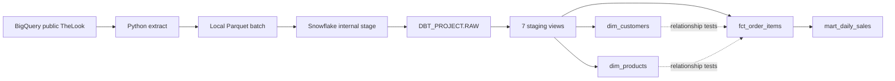

# TheLook eCommerce Analytics Engineering

A personal portfolio project that extracts the public TheLook dataset from BigQuery, loads immutable Parquet batches into Snowflake, and builds tested dbt staging and sales models.

**Validated snapshot:** 7 source tables, 3,353,395 rows, 7 staging views and 4 sales tables. The 58 staging tests and 34 sales tests passed in separate local dbt Core builds against Snowflake. After the daily mart's Jinja refactor, its 7 selected tests passed again. The current implementation has not yet been verified in dbt Cloud.

## Architecture



- Python handles extraction and loading; dbt handles transformations and data tests.
- RAW preserves extract history with `_BATCH_ID` and `_EXTRACTED_AT`.
- Staging explicitly selects the verified complete batch `20261005T161059Z`; it does not independently choose the latest batch per table.
- Staging uses views in `ANALYTICS_STAGING`; sales models use tables in `ANALYTICS_MARTS` with the default local target schema.
- No mandatory intermediate layer was added: the current transformations do not yet require reusable intermediate models.

## Data scope

| Source table | Rows in the validated batch |
|---|---:|
| distribution_centers | 10 |
| products | 29,120 |
| users | 100,000 |
| orders | 125,564 |
| order_items | 181,758 |
| inventory_items | 490,655 |
| events | 2,426,288 |
| **Total** | **3,353,395** |

Extracted on 2026-10-05; the full batch was loaded and profiled on 2026-10-06. An earlier 10-row smoke-test batch remains in RAW and is excluded from staging.

## Sales outputs

| Model | Grain | Rows |
|---|---|---:|
| dim_customers | One source user, including non-buyers | 100,000 |
| dim_products | One product in the selected snapshot | 29,120 |
| fct_order_items | One source order item | 181,758 |
| mart_daily_sales | One UTC parent-order creation date | 2,781 |

The fact covers 125,564 orders and 80,205 distinct buyers. `completed_sales_amount` includes only items currently marked `complete`. Cancelled and returned item amounts are separate; they are not verified cash refunds. Gross margin subtracts the linked inventory unit cost, not current product catalog cost, and is not net profit. The source does not specify a currency column.

The daily mart reports order cohorts using current snapshot statuses, not accounting revenue or payment cash flow. See [metric definitions](docs/sales_models.md) and [saved aggregate KPIs](docs/sales_kpis_20261006.json).

## Quality and dbt features

- `source()` and `ref()` declare dependencies and resolve warehouse relations.
- YAML generic tests validate required values, uniqueness, relationships and accepted domains.
- A custom generic test reconciles nonempty selected-batch RAW/staging counts.
- Four singular sales tests validate dimension coverage, per-item source-to-fact values, declared order quantities and independent source-to-daily aggregates.
- A batch variable and validation macro prevent accidental mixing of snapshots.
- A model-local Jinja loop generates status count columns. The reconciliation test keeps independent SQL.
- Tags allow scoped builds; manifests, catalogs and run results preserve evidence.

The profile found 1,124,536 anonymous events, missing product names/brands, and timestamps later than extraction. Staging preserves these values rather than silently dropping rows. [Full profile](docs/thelook_profile_20261005T161059Z.md)

## Run locally on Windows

Use Python 3.12 and a project-local environment:

```powershell
uv venv .venv --python 3.12
uv pip install --python .venv\Scripts\python.exe -r requirements-dev.txt -r requirements-ingestion.txt
if (-not (Test-Path profiles.yml)) { Copy-Item profiles.example.yml profiles.yml }
if (-not (Test-Path .env)) { Copy-Item .env.example .env }
```

Configure `.env` locally and Google Application Default Credentials for extraction. Keep the Snowflake private key outside the repository and register its public key to the Snowflake user. Existing loaded data is sufficient for dbt builds; extraction is not required on every run.

```powershell
# Offline project validation:
.\.venv\Scripts\dbt.exe parse --profiles-dir .
# Warehouse execution, with .env loaded by the wrapper:
.\.venv\Scripts\python.exe scripts\dbt_local.py build
# When only sales models changed:
.\.venv\Scripts\python.exe scripts\dbt_local.py build --select tag:sales
# Generate standalone dbt documentation while Snowflake is available:
.\.venv\Scripts\python.exe scripts\dbt_local.py docs generate --static
# Export the entire daily mart, object DDL and documentation:
.\.venv\Scripts\python.exe scripts\export_portfolio.py
```

For extraction/loading, setup SQL and macOS commands, see [development workflow](docs/development_workflow.md). Before changing `thelook_batch_id`, load and validate all seven tables and rebuild staging and sales together. Starter example files are retained but disabled.

## Evidence and offline use

- [Staging validation](docs/staging_validation_20261006.json): 7 views and 58 passing tests.
- [Sales validation](docs/sales_validation_20261006.json): 4 tables and 34 passing tests.
- Full build artifacts are stored locally under ignored `data/validation/`.
- Backups under ignored `data/portfolio_backup/<timestamp>/` contain the complete daily mart as Parquet and JSON, source/model DDL, a dbt catalog, standalone `static_index.html`, and SHA-256 checksums.
- Original source Parquet files remain under ignored `data/thelook/20261005T161059Z/`.

Copy these local data folders to a personal backup location before retiring this computer. They are deliberately not pushed to GitHub. Object DDL recreates structure, not source rows; the original Parquet batch is required to rebuild the warehouse. Do not treat local backups as off-device disaster recovery.

## dbt Cloud handoff

1. Open the existing Analytics project and preserve any uncommitted Cloud edits.
2. Select `feature/raw-ingestion` and pull its latest commits.
3. Keep the existing Snowflake connection and development environment.
4. Run `dbt build`. Save the run output and check the target schema names for that environment.

Local builds already ran against Snowflake; Cloud execution is a separate pending check.

## Remaining work

- Current-branch dbt Cloud execution, scheduled orchestration and CI.
- A least-privilege role: the development connection currently uses ACCOUNTADMIN.
- A date spine, dashboard/exposures and event/session analytics.
- Incremental models and SCD2, only after observing source changes across subsequent extracts.
- Further validation of source usage/export terms before redistributing datasets; raw data is not included in this repository.

This is a tested single-snapshot portfolio pipeline, not a production deployment or financial accounting system.
