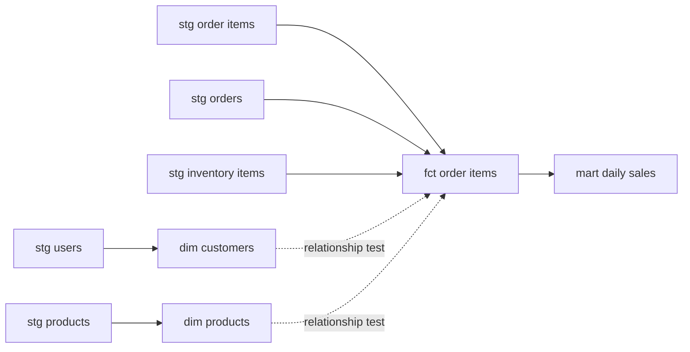

# Sales models and metric definitions

## Scope and grains

All models use the same selected extract batch as staging: 20261005T161059Z. These are full-refresh table models in DBT_PROJECT.ANALYTICS_MARTS, not incremental models.

| Model | Grain | Validated rows |
|---|---|---:|
| dim_customers | One source user, including users without orders | 100,000 |
| dim_products | One product | 29,120 |
| fct_order_items | One source order item | 181,758 |
| mart_daily_sales | One UTC parent-order creation date | 2,781 |

Dimensions represent the selected snapshot, not historical SCD2 versions. The customer dimension deliberately omits email and street address. Natural source IDs are used because there is one source and one selected snapshot.

## Business definitions

- One order item represents one inventory unit; item_quantity is 1.
- item_amount is sale_price for every status. It is not recognized revenue.
- completed_sales_amount includes only items whose current status is complete. Shipped and processing items are excluded, as are cancelled and returned items.
- completed_cost_amount uses the linked inventory unit's cost for complete items. The current product catalog cost is not used to reconstruct historical sales cost.
- completed_gross_margin_amount is completed sales minus completed inventory cost. It is not net profit: shipping, tax, marketing and operational costs are not available.
- cancelled_item_amount and returned_item_amount show the sale amounts of items currently in those states. They do not establish cash refunds or refund dates. Returns are already excluded from completed sales and must not be subtracted from it a second time.
- Monetary values are explicitly cast to NUMBER(18,4) before calculations. The source has no currency column; no currency symbol or currency conversion is assumed.
- The daily mart assigns all items to the parent order's UTC creation date. It describes order cohorts using the extract's current lifecycle status, not daily recognized revenue, payment cash flow, or a return-date ledger.
- Daily distinct customer counts are not additive across dates. Count distinct customer_id directly from the fact for a whole-period buyer count.
- Source timestamps later than extraction are retained and flagged. No silent date-based row removal is performed.
- Days without orders are absent; a calendar dimension/date spine is not implemented yet.

## Dependency flow

## Validation

On 2026-10-06, `dbt build --select tag:sales` successfully created four tables and passed all 34 selected tests with zero warnings/errors/skips. The dbt execution phase took 9.13 seconds, excluding process startup. This is not a compute-credit measurement.

The 34 tests include ordinary key, null, relationship and status-domain checks plus four business reconciliations:

1. Dimensions preserve the source key sets and row counts.
2. Each fact row matches its staged source key, amount, status, customer, product, parent order date and inventory cost. Uniqueness tests additionally catch join fanout.
3. Fact item counts match each source order's declared item count.
4. Every daily amount and count matches an independent aggregation of staging data, including all status buckets and the future-timestamp count.

Earlier staging validation passed 58 tests. The project now contains 92 data tests; the latest build ran the 34 sales tests, not all 92 again. Results are recorded in sales_validation_20261006.json; full artifacts are archived locally under ignored data/validation/sales_20261006.

## Observed aggregate output

- 125,564 orders and 181,758 order items.
- 80,205 distinct buyers, from a source user population of 100,000.
- Parent-order dates: 2019-01-06 through 2026-10-05 UTC.
- Ordered item amount across all statuses: 10,865,059.9200.
- Complete-item sales amount: 2,690,628.6400.
- Complete-item inventory cost: 1,293,415.5433.
- Complete-item gross margin amount: 1,397,213.0967.

These amounts are in unspecified source currency units. Saved KPI output and the latest ten order dates are in sales_kpis_20261006.json. The query is reproducible from analyses/sales_kpis.sql.

## Run and limitations

Locally: `.venv/Scripts/python.exe scripts/dbt_local.py build --select tag:sales` after staging has been built for the same batch. For a new batch, rebuild staging and sales together before publishing results. In dbt Cloud, synchronize the code and use the existing connection; this milestone was validated via local dbt Core against Snowflake.

Still outstanding: historical snapshots and change-based loading, an explicit currency/business accounting contract, a date spine, scheduling/CI, dashboard/exposures, dbt Cloud verification of the current branch, and a least-privilege execution role. Current tests validate the selected snapshot and declared metric logic, not real financial correctness.
